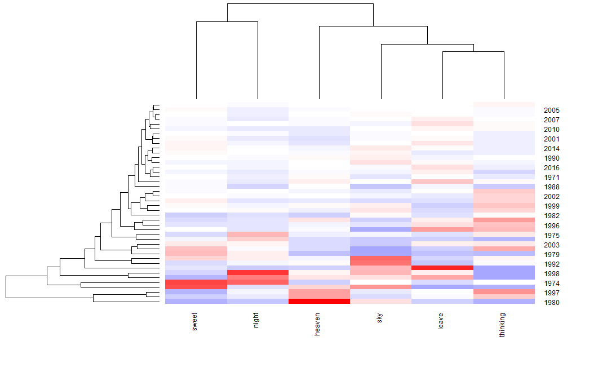
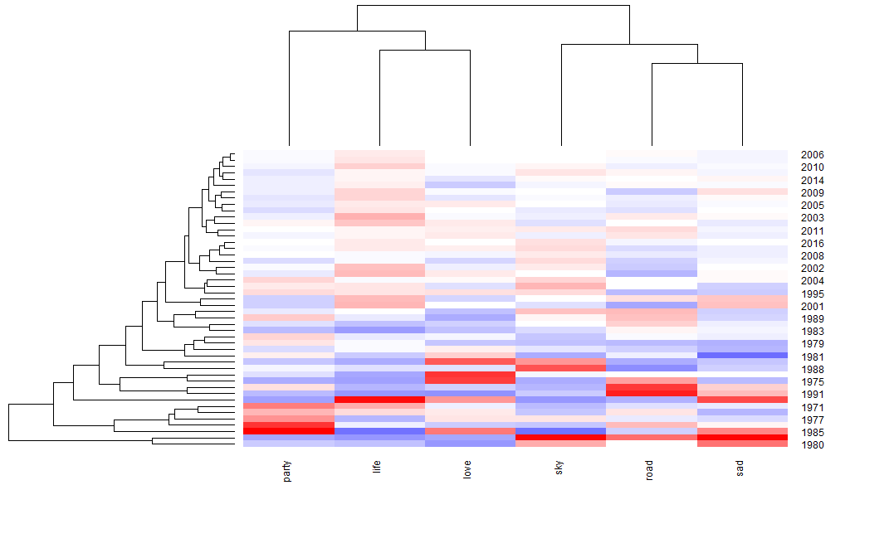

# SectionI - Intro:

There are lots of different music genres appear during the last 40 years. What are those popular ones? Do popular genres have something in common? Do their topics change over time? That’s what I want to discover in this blog. 


**What are the popular genres during the last 40 years?**

First, let me load packages that may be useful in the analysis.
```{r, message=FALSE, warning=FALSE, echo=FALSE}

# load packages
library("rvest")
library("tibble")
library("qdap")
library("sentimentr")
library("gplots")
library("dplyr")
library("tm")
library("syuzhet")
library("factoextra")
library("beeswarm")
library("scales")
library("RColorBrewer")
library("RANN")
library("tm")
library("topicmodels")
library("readtext")
library("ggplot2")
library("tidyr")
```

Then,using data manipulation tricks in R, I can easily calculate the number of records in different genres from 1970 to 2016. The results show that Rock, Pop and Metal are the 3 most popular music genres during the last 40 years. 

```{r}
load('../output/processed_lyrics.RData') 
df<-dt_lyrics%>%group_by(genre)%>%count()%>%arrange(desc(n))
head(df,3)
```

Note: Here I suppose that the records of different genres are chosen uniformly so that the number of records each year can reflect the popularity of that genre in that year. However, if the records were chosen from a non-uniform distribution, the result would be biased, thus become inaccurate. Luckily, this will not influence the topic modelling step.

# SectionII - Method:

Since Rock and Pop are two most popular genres, I choose to run sentiment analysis and topic modelling on both.  

**What data do I use?**

Here I use the code in /docs/Text_Preprocessing to preprocess the original lyrics data. The function of this process is to stem the words of each song and pick up the emotion related ones. This will relegate the burden we have in the following analysis. 

```{r, echo =FALSE}
load("../output/sentence.rock1.RData")
load("../output/sentence.rock2.RData")
load("../output/sentence.pop.RData")
sentence.rock<-rbind(sentence.rock1,sentence.rock2)
```

**What methods do I use?**

Two methods I use here are sentiment analysis and topic modelling. In order to analysis the change of emotion and topics over time, I will group the processed data by year. If everything goes as expected, one may observe the topics and emotion change over time. 

# SectionIII - Anaysis:

**Is there any difference between the emotion of Rock and Pop?**

Using nrc_sentiment function, I can get the frequency of words that represent different emotions in each song. For each song, I use the number of negative words divided by the sum of negative and positive words to represent the overall emotion of that song (i.e if the number of negative words is larger than the number of positive words, this metric would be less than 0.5.). 

```{r, echo = FALSE}
d<-rbind(sentence.pop,sentence.rock)%>%mutate(n=negative/(negative+positive))%>%filter(is.na(n)!=T)%>%group_by(year,genre)%>%summarise(n=mean(n))
g1<-ggplot(data=d,aes(x=year,y=n,color=genre))+geom_line()+labs(title='proportion of negative songs in different years')
g1
```

After plotting the proportion of songs that express negative feelings from two genres each year, I observe that there is a clear difference between two genres. Pop music tends to express positive emotion more often than Rock music since the proportion of negative Pop songs each year almost always below 0.5. 

A more detailed display further confirms my assumption. First, I can see some similarities between the emotion expression of two genres. Like disgust and surprise are uncommon emotions compared with joy and sadness. Second, the joy value of Pop music is larger than Rock music while the disgust and anger values of Pop music is smaller than Rock music.

```{r, echo=FALSE}
d1<-rbind(sentence.pop,sentence.rock)%>%group_by(genre)%>%summarise_at(vars(anger:trust),mean)%>%pivot_longer(cols=c(2,3,4,5,6,7,8,9))
g2<-ggplot(data=d1)+geom_bar(aes(x=name,y=value),stat='identity')+facet_wrap(~genre)+coord_flip()
g2
```

Note: One may also notice that the lines are more unstable during the 1970s. The reason may be that the number of 1970s' songs recorded in table is small (less than 100 each year) while the number of 2000s' songs recorded in table is large (more than 1000 each year), so that the variance decreases as the time progresses.   

**Do the topics of popular genres change overtime?**
```{r, echo=FALSE}
load('../output/Pop/ldaout.pop.RData')
load('../output/Rock/ldaOut.rock.RData')
load('../output/Pop/df.RData')
load('../output/Rock/dfR.RData')
```

Here I use topic modelling to individually analysis the topics in Rock and Pop. Here, I choose to divide the topics of song into 15 categories. After this process, I observe that there are similar topics among two genres, but these topics have different orders in two genres. For example, the Topic8 of Pop music have words like 'dance', 'beat' and 'party' that are correlated to the Topic2 of Rock music (which has 'dance', 'play' and ''drink). This indicates two genres have their own preferences in choosing the topic.

```{r}

ldaOut.termspop <- as.matrix(terms(ldaOut.pop,10))
ldaOut.termsrock <- as.matrix(terms(ldaOut.rock,10))
ldaOut.termspop
ldaOut.termsrock
```

After this process, I group the song by year and cluster the topics by year. From the heatmap, one can see that adjacent years tend to cluster together and share common topics. More specifically, the upper half of two heatmaps represent most of the years after 2000 while the bottom half of two heatmaps represent most of the years around 1990.

Notice that the color is strong in the bottom half of two heatmaps but the upper half of Pop heatmap becomes inapparent. This indicates that the Pop songs in recent years contain a lot of information, thus can cover a range of topics (so the algorithm can't really figure out a specific topic). On the other hand, the topic of Pop and Rock songs are changing gradually.("sweet" topic before 2000 &"leave" topic after 2000 for Pop and "sad" topic before 2000 & "life" topic after 2000 for Rock.

```{r, echo=FALSE}
ldaOut.topicsrock <- as.matrix(topics(ldaOut.rock))
ldaOut.topicspop <- as.matrix(topics(ldaOut.pop))
topicProbabilitiesrock <- as.data.frame(ldaOut.rock@gamma)
topicProbabilitiespop <- as.data.frame(ldaOut.pop@gamma)

dfR$ldatopic=as.vector(ldaOut.topicsrock)
topics.hash=c("sky", "party", "life", "love", "road", "sad", "sweet", "die", "heartbreak", "body", "hope", "night", "sing", "people", "girls")
dfR$ldahash=topics.hash[ldaOut.topicsrock]
colnames(topicProbabilitiesrock)=topics.hash
dfrock=cbind(dfR,topicProbabilitiesrock)

topic.summary=tbl_df(dfrock)%>%
select(year, sky:girls)%>%
group_by(year)%>%
summarise_at(vars(sky:girls),mean)


topic.summary=as.data.frame(topic.summary)
rownames(topic.summary)=topic.summary[,1]
topic.plot=c(1, 2,3,4,5,6)

#the code that generate the pic, already loaded for you
#g3<-heatmap.2(as.matrix(topic.summary[,topic.plot+1]), 
#scale = "column", key=F, 
#col = bluered(100),
#cexRow = 0.9, cexCol = 0.9, margins = c(8, 8),
#trace = "none", density.info = "none", main='Rock music heatmap')
#g3

df$ldatopic=as.vector(ldaOut.topicspop)
topics.hash=c("sky", "night", "thinking", "leave", "heaven", "sweet", "love", "party", "friend", "girls", "Families", "heartbreak", "bad_boy", "cry", "self")
df$ldahash=topics.hash[ldaOut.topicspop]
colnames(topicProbabilitiespop)=topics.hash
dfpop=cbind(df,topicProbabilitiespop)

topic.summary=tbl_df(dfpop)%>%
 select(year, sky:self)%>%
     group_by(year)%>%
     summarise_at(vars(sky:self),mean)

topic.summary=as.data.frame(topic.summary)
rownames(topic.summary)=topic.summary[,1]

# the code that generate the pic, already loaded for you
# g4<-heatmap.2(as.matrix(topic.summary[,topic.plot+1]), 
#          scale = "column", key=F, 
#          col = bluered(100),
 #         cexRow = 0.9, cexCol = 0.9, margins = c(8, 8),
 #         trace = "none", density.info = "none",main="Pop music heatmap")
#g4
```

**Pop music heatmap**


**Rock music heatmap**



# SectionIV - Summary:

In conclusion, Pop music and Rock music are different in many aspects.

1. Pop songs express more positive emotions than Rock songs.

2. The preferenced topics in two genres do change over time. They may share some topics, but the orders of the topics are different.

3. Pop songs in recent years can cover a range of topics so it's difficult for algorithm to choose a specific topic for them.
